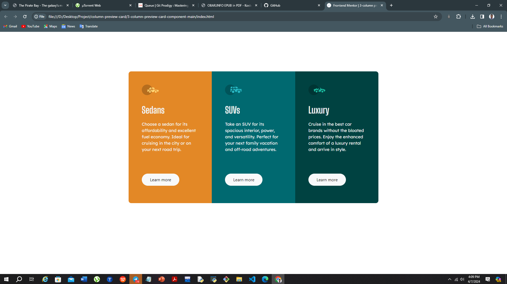

# Frontend Mentor - 3-column preview card component solution

This is a solution to the [3-column preview card component challenge on Frontend Mentor](https://www.frontendmentor.io/challenges/3column-preview-card-component-pH92eAR2-). Frontend Mentor challenges help you improve your coding skills by building realistic projects. 

## Table of contents

- [Overview](#overview)
  - [The challenge](#the-challenge)
  - [Screenshot](#screenshot)
  - [Links](#links)
- [My process](#my-process)
  - [Built with](#built-with)
  - [What I learned](#what-i-learned)
  - [Continued development](#continued-development)
  - [Useful resources](#useful-resources)
- [Author](#author)
- [Acknowledgments](#acknowledgments)

**Note: Delete this note and update the table of contents based on what sections you keep.**

## Overview

### The challenge

Users should be able to:

- View the optimal layout depending on their device's screen size
- See hover states for interactive elements

### Screenshot



### Links

- Solution URL: [Add solution URL here](https://your-solution-url.com)
- Live Site URL: [Add live site URL here](https://your-live-site-url.com)

## My process

### Built with

- Semantic HTML5 markup
- CSS custom properties
- Mobile-first workflow
- [Bootstrap](https://bootstrap.org/) - JS library

**Note: These are just examples. Delete this note and replace the list above with your own choices**

### What I learned

I was stuck when i was trying to give outer div a border-radius which I couldn't. but after a lot of searching I found out I can i achieve this using the overflow custom css property.

```html
<h1>Some HTML code I'm proud of</h1>
```
```css
.proud-of-this-css {
  overflow: hidden;
}
```

### Continued development

I want to work more on my loyout skills.

### Useful resources

- [Bootstrap](https://www.bootstrap.com) - This helped me to make my design is responsive and mobile first.
- [GeminiAI](https://www.Gemini.com) - This is an amazing resource which helped me to figure out some custom css properties and rules.

**Note: Delete this note and replace the list above with resources that helped you during the challenge. These could come in handy for anyone viewing your solution or for yourself when you look back on this project in the future.**

## Author

- Frontend Mentor - [@Kumneger](https://www.frontendmentor.io/profile/kumneger49)
- Twitter - [@Kumneger](https://www.twitter.com/kumneger49)

**Note: Delete this note and add/remove/edit lines above based on what links you'd like to share.**

## Acknowledgments

Bootstrap 5.0 documentation
Gemini.ai